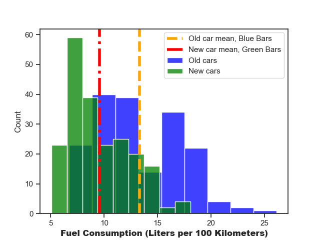
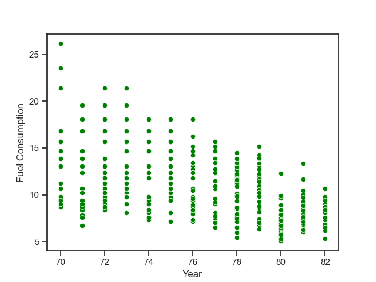

I got an email from a new client named Swedcar.  
They manufacture and refurbish fuel efficient motors for repair shops.
   
The email states that they would like to present an analysis to their customer (Stures bil AB) in order to sell their new fuel efficient motors.

They want me to make the data set more appealing and make it more readable for a European demographic.

The email also mentions Stures Car AB seems a bit stuck in the past so I'll have to make sure to be confident in my findings to make Swedcars selling points stronger. 


```py 
# Importing packages and functions
import pandas as pd

import matplotlib.pyplot as plt
import seaborn as sns
import plotly as px

import scipy.stats as scs
from scipy.stats import t
import numpy as np

import statsmodels.api as sm
from statsmodels.formula.api import ols
from Functions import func_rename, func_conversion

from sklearn.linear_model import LinearRegression

sns.set_theme(style="ticks")  # Setting the theme for all plots

```
### First lets start with exploring / cleaning the data  
```py
# Importing and cleaning data
filepath = "../Lab/Data/cars.csv"  # Creating filepath
df = pd.read_csv(filepath)  # reading csv with pandas

# Adding columns
df[["name", "test"]] = df["name"].str.split(
    " ", 1, expand=True
)  # Creating a new column
df.rename(
    columns={"name": "make", "test": "model", "mpg": "lper100km"}, inplace=True
)  # Renaming columns
cars = df  # Creating a new dataframe

# Handling spelling mistakes:
#   The spelling mistakes were found by manually looking through the data.
#   func_rename can be found in the Functions.py file
func_rename(cars, "vw", "volkswagen"), func_rename(cars, "vokswagen", "volkswagen")
func_rename(cars, "chevy", "chevrolet"), func_rename(cars, "chevroelt", "chevrolet")
func_rename(cars, "maxda", "mazda"), func_rename(cars, "toyouta", "toyota")
func_rename(cars, "mercedes-benz", "mercedes"),

# Converting the weight and miles per gallon into the metric system.
#  func_conversion can be found in the Functions.py file
func_conversion(cars, "weight")
func_conversion(cars, "lper100km")

# Lets check if any data is missing.
cars.isna().sum()
np.where(cars.isna().any(axis=1))  # Checking for nans.
nanlist = [32, 126, 150, 330, 336, 346, 354, 374]  # The indexes for nan values.
for i in range(len(nanlist)):
    print(cars.iloc[nanlist[i]])  # Simple forloop to print out all nan rows.

# Total NaNs in dataframe is 8. 8/len(cars) ~ 2 %
# I find it acceptable to drop NaNs due to the value being so low. Would it be higher I would have to fill the data with the mean or ask the client for a complete sample

cars.dropna(inplace=True)
```
Now with the data cleaned and imperial units converted into metric for a European demographic I'll start exploring the data.  

Note: This will also make the data set easier to work with in the future
  
```py
cars.describe() # Used to get an overview of the data. 
```
## Auto-mpg dataset statistical analysis
  
One way that Swedcar can prove that their new engines are more efficient than the motors Stures bil AB is using today is comparing newer car manufacturing to older in order to prove that newer cars are more fuel efficient.  
  
```py
# Ill start by splitting the data set. into two parts dependant of the year.
cars["model_year"].unique()
cars_older = cars[
    (cars["model_year"] == 70)
    | (cars["model_year"] == 71)
    | (cars["model_year"] == 72)
    | (cars["model_year"] == 73)
    | (cars["model_year"] == 74)
    | (cars["model_year"] == 75)
]
cars_newer = cars[
    (cars["model_year"] == 76)
    | (cars["model_year"] == 77)
    | (cars["model_year"] == 78)
    | (cars["model_year"] == 79)
    | (cars["model_year"] == 80)
    | (cars["model_year"] == 81)
    | (cars["model_year"] == 82)
]
```
### Time to compare the means, variance and most fuel efficient car between the data sets.  
I will do this in order to get a better grasp of the data
```py
new_car_mean = cars_newer["lper100km"].mean()
old_car_mean = cars_older["lper100km"].mean()
print(
    f"Mean value for liters per 100km.\nOlder cars: {round(old_car_mean, 4)}\nNewer cars: {round(new_car_mean, 4)}"
)
print(
    f"Most fuel efficient value for older cars: {cars_older['lper100km'].min()}\nMost fuel efficient value for newer cars: {cars_newer['lper100km'].min()}"
)
print(
    f"Variance for older: {round(cars_older['lper100km'].var(), 2)}\nVariance for newer: {round(cars_newer['lper100km'].var(), 2)}"
)
```
    Mean value for liters per 100km.  
    Older cars: 13.2859  
    Newer cars: 9.5491  
  
    Most fuel efficient value for older cars: 6.72  
    Most fuel efficient value for newer cars: 5.05  
  
    Variance for older: 15.74  
    Variance for newer: 8.63  
  
### Across the board wins for newer cars! Perfect, but to make Swedcars job to sell their motors to Stures bil AB a bit easier I will visualise the data.

```py
# Lets compare the two data sets in a graph:

ax_1 = sns.histplot(cars_older, x="lper100km", color="blue", label = "Old cars").axvline(
    old_car_mean,
    linestyle="--",
    linewidth=4,
    label="Old car mean, Blue Bars",
    color="orange",
)
ax_2 = sns.histplot(cars_newer, x="lper100km", color="green", label = "New cars").axvline(
    new_car_mean,
    linestyle="-.",
    linewidth=4,
    label="New car mean, Green Bars",
    color="red",
)
plt.xlabel("Fuel Consumption (Liters per 100 Kilometers)", size=12)
plt.legend()
plt.savefig("mean_graph")
plt.show()

```
  
  
From what we can see from the above graph newer cars shown in green are more fuel efficient than the older ones shown in blue.  
### Important note. A lower value for Fuel Consumption is preferred  
This is a rather small sample size if we compare it to all cars manufacured during this time.    
So I will calculate the true means by using a 95 % confidence interval.  
This will show that the sample mean is true to reality.  
  
```py
alpha = 0.05

# Calculating the true mean.
cars_older_ci = scs.t.interval(
    confidence=1 - alpha, # Setting Confidence
    df=len(cars_older), # Setting Degrees of freedom
    loc=np.mean(cars_older["lper100km"]), # Setting the mean
    scale=scs.sem(cars_older["lper100km"]), # calculate standard error of the mean.
)
cars_newer_ci = scs.t.interval(
    confidence=1 - alpha,
    df=len(cars_newer) - 1,
    loc=np.mean(cars_newer["lper100km"]),
    scale=scs.sem(cars_newer["lper100km"]),
)


print(
    f"Confidence interval with (\u03B1=0.05) fuel consumption {round(cars_older_ci[0],4), round(cars_older_ci[1],4)}\nDifference = {round(cars_older_ci[1] - cars_older_ci[0],4)}\nOlder car mean is inbetween upper and lower values {round(old_car_mean,4)}"
)
print(
    f"\nConfidence interval with (\u03B1=0.05) fuel consumption {round(cars_newer_ci[0],4), round(cars_newer_ci[1],4)}\nDifference = {round(cars_newer_ci[1] - cars_newer_ci[0],4)}\nNewer car mean is inbetween upper and lower values {round(new_car_mean,4)}"
)
```
    Confidence interval with (α=0.05) fuel consumption (12.7008, 13.8711)  
    Variance = 1.1703  
    Older car mean is inbetween upper and lower values 13.2859  

    Confidence interval with (α=0.05) fuel consumption (9.1504, 9.9479)  
    Variance = 0.7975  
    Newer car mean is inbetween upper and lower values 9.5491  

```py
# T-Test
scs.ttest_ind(cars_older_ci, cars_newer_ci)
```
    Ttest_indResult(statistic=5.277015415920429, pvalue=0.034085227722945526)
  
### Because $p=0.034 < \alpha = 0.05$ we know that we can be 95% sure that there is a significant difference between older and newer cars fuel consumption  
  
With this information I am able to show that my findings in this data set / sample is applicable in the real world market as well, So Swedcar is getting a much stronger selling point.    

Let's get back to the combined dataset again and lets see if we can predict how fuel efficient Swedcars new motors will be, based on our limited dataset.
  
```py
# Ill do a quick scatterplot in order to see if there is any potential in a prediction first
fig = sns.scatterplot(cars, x="model_year", y="lper100km", color="green")
plt.xlabel("Year")
plt.ylabel("Fuel Consumption")
plt.savefig("scatter_graph")
plt.show()
```
  
  
  ### Looks like we have a clear trend downwards when it comes to fuel consumption. 
  I will test to see if a linear regression model can prove this.
```py
model = LinearRegression()  # Setting the model as Linear Regression
X = cars["model_year"].values.reshape(-1, 1)  # Choosing and reshaping model year
y = cars["lper100km"].values  # y as efficiency
model.fit(X, y)  # Fitting the model

# Fit the linear regression model
slope, intercept, r_value, p_value, std_err = scs.linregress(
    X.flatten(), y
)  # Getting values from scipy stats lingress.

# Create a range of future model years
future_model_years = np.arange(
    df["model_year"].min(), df["model_year"].max() + 4, 1
).reshape(-1, 1)

# Predict the lper100km for future years
ypred = slope * future_model_years + intercept  # Calculating the future predictions
pred_years = np.array(
    [[83], [84], [85], [95]]
)  # Setting values for years to predict. 1983, 1984 and so on.
pred_lp100km = model.predict(pred_years)  # using model to predict the years.
# Creating a scatter plot with the regression line
plt.scatter(cars["model_year"], y, label="Observed", color="Green")

# Plotting the model.
plt.plot(
    future_model_years,
    ypred,
    color="Black",
    label="Predicted",
    linewidth=3,
)
plt.plot(
    84, 6.5, marker="X", color="red", label="Predicted point"
)  # plotting a prediction plot.
plt.text(83, 10, "6.5 liters", fontsize=12),  # Prediction value
plt.arrow(
    84.3, 9.8, -0.2, -2.3, color="black", width=0.1
)  # Arrow pointing towards prediction point
plt.xlabel("Year")
plt.ylabel("Fuel Consumption (Liters per 100 Kilometers)")
plt.legend()
plt.savefig("lin_pred_graph")
plt.show()
# Printing out values and predictions.
print(
    f"Predicted liters per kilometer for: \n1983: {pred_lp100km[0]:.4f}\n1984: {pred_lp100km[1]:.4f}\n1985: {pred_lp100km[2]:.4f}"
)
print(
    f"\nSlope: {slope:.4f},     This is a negative slope, this means that when X (year) increases Y (fuel consumption) decreases 
    \nIntercept: {intercept:.4f}    is not a valid value due to checking year when Fuel Consumption is set to 0.  
    \nP-value < {p_value:.3f}1       So with (\u03B1=0.05) it is very significant.
    \nR: {r_value:.4f}            is strong enough correlation for this use case 
    \nStandard Error: {std_err:.4f}      Mean of distance from observed points and predicted line"
)
# Intercept is not valuable in this example due to years not being able to be set to 0 Intercept simply anchors the regression line in the right place
# Regression coefieccent is tied to how many "points" will change each aditional year.
# P-value is significant.


```

 
  
    Predicted liters per kilometer for: 
    1983: 7.0934
    1984: 6.5000
    1985: 5.9065

    Slope: -0.5934,             This is a negative slope, that means that when X (year) increases Y (fuel consumption) decreases 
      
    Intercept: 56.3491          is not a valid value due to checking year when Fuel Consumption is set to 0.  
      
    P-value < 0.0001            So with (α=0.05) it is very significant.

    R: -0.5580                  is strong enough correlation for this use case 

    Standard Error: 0.0448      Mean of distance from observed points and predicted line
  
  
 We can see a steady decline in liters consumed per 100 kilometers in the years to come.  
A obvious issue with this model is that fuel consumption eventually will reach zero and negative values.  
In todays technology that is impossible so we can gather that there must be one or more variables at play when it comes to fuel consumption.
Or if we zoom out from this graph we might be able to see a exponential curve flattening out the further into the future we go.   
With future breakthroughs we might be able to see a sudden drop aswell but that is pure speculation.
```py
# Proving the flaw mentioned above by printing out prediction for 1995
print(f"Predicted liters per 100 kilomiter for: 1995: {pred_lp100km[3]:.4}")
```
    Predicted liters per 100 kilomiter for: 1995: -0.0279

So with that it is inappropriate to use linear regression to predict fuel efficiency soley by using years as a variable.
  
But I'm confident that my findings truly show that modern cars are more fuel efficient than older cars.   
  
Even though there are many variables such as weight, horsepower and cylinders that might play a big part in if a motor is efficient or not.   Swedcar will be able to confidently show Stures bil AB that modern motors are more fuel efficient than the older motors they use now.